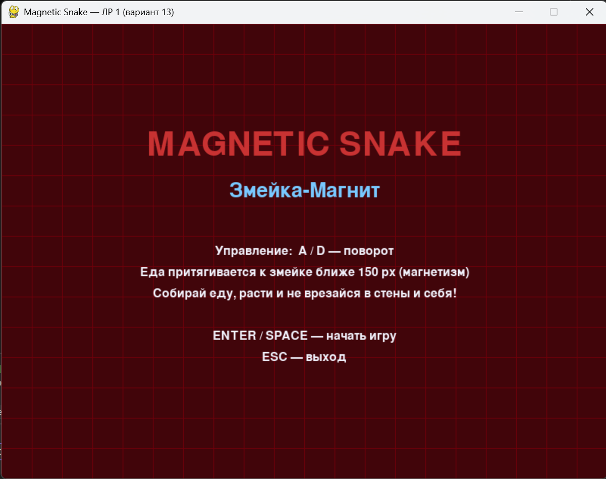
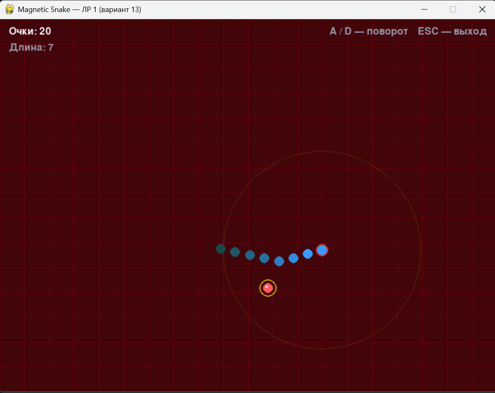
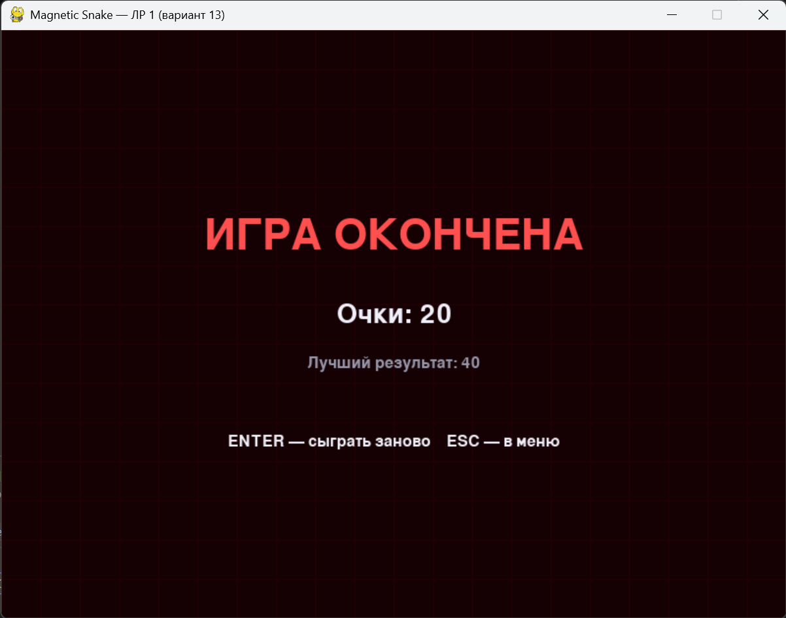

# Magnetic Snake — ЛР 1 (вариант 13)

2D-игра на Python + Pygame: змейка со свободной траекторией движения.
Еда дрейфует по экрану, а при приближении головы на расстояние
менее 150 пикселей — притягивается к ней (магнитное поле).

## Запуск
```bash
python main.py
```

## Управление
| Клавиша | Действие |
|---------|----------|
| A / ←   | поворот влево |
| D / →   | поворот вправо |
| SPACE / ENTER | начать игру / рестарт |
| ESC     | выход |

## Правила
1. Голова змейки движется под углом, который меняется клавишами A/D.
2. Тело — «история» позиций головы (свободная траектория).
3. Еда дрейфует по экрану.
4. Если еда ближе 150 px к голове — она притягивается с ускорением.
5. Съел еду → +10 очков, змейка растёт.
6. Врезался в стену или в собственный хвост → Game Over.

## Скриншоты




## Структура проекта
- `constants.py` — все константы
- `snake.py` — класс `Snake`
- `food.py` — класс `Food`
- `game.py` — игровой цикл и состояния
- `main.py` — точка входа
